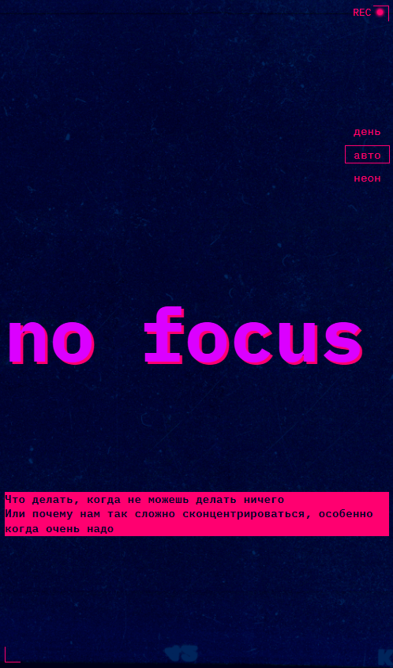
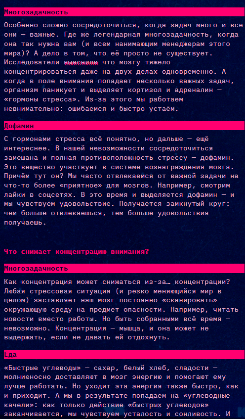
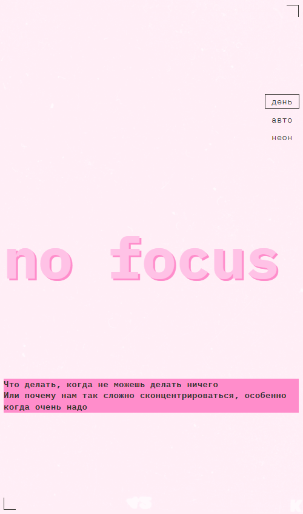
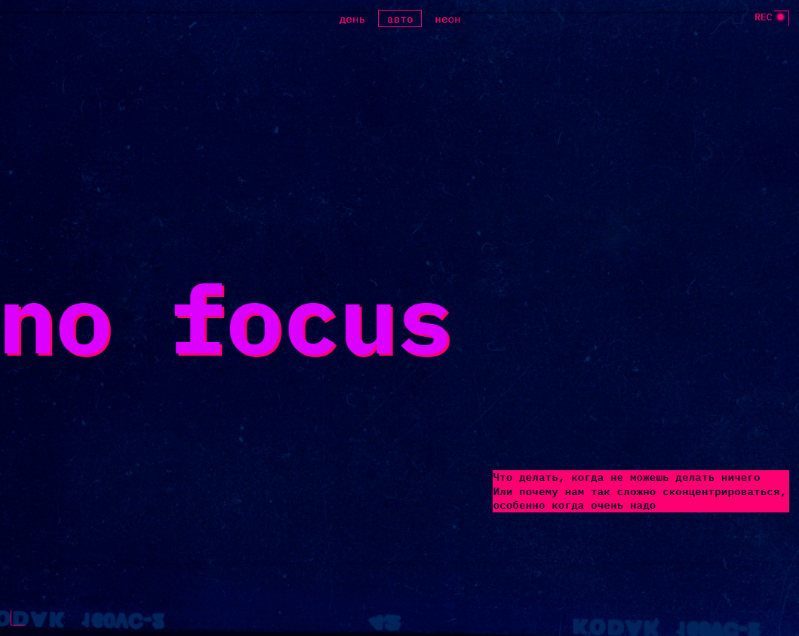
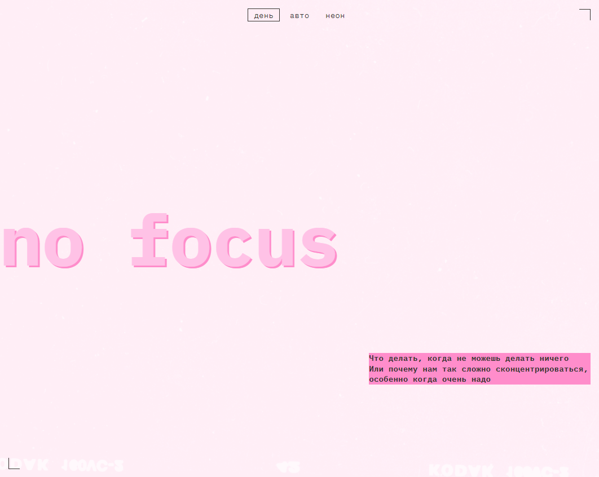

https://github.com/RiconCla/slozhno-sosredotochitsya.git 
# Работа "Сложно сосредоточиться"

## Оглавление

- [Запуск](#запуск)
- [Скриншоты](#скриншоты)
- [Описание](#описание)
- [Благодарность](#благодарность)

### Запуск

Достаточно перейти на [GitHub Pages](https://riconcla.github.io/slozhno-sosredotochitsya/)

### Скриншоты

### Описание

Проект о проблемах с фокусом и концентрации внимания. В данной работе реализован адаптивный дизайн. Также реализованы Темная/Светлая и Авто(которая выбирает цветовую схему в заивимости от настроек ОС пользователя) темы.

Использованные технологии: HTML, CSS, FLEX, GRID, BEM, Responsive, media queries, JS